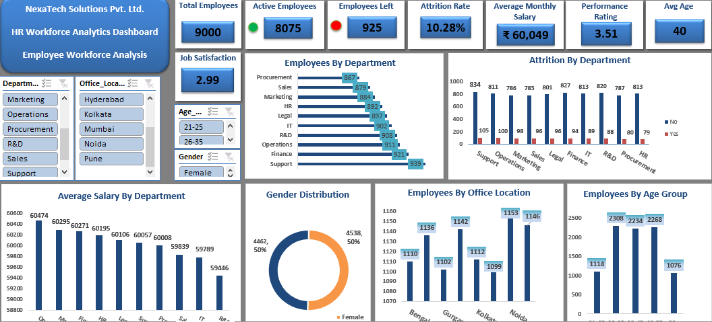

 HR Workforce Analytics Dashboard

An interactive **HR Workforce Analytics Dashboard** built in **Microsoft Excel** using Pivot Tables, Pivot Charts, KPI Cards, Slicers, and Dashboard Design techniques. This project helps HR teams analyze workforce distribution, attrition trends, salary patterns, demographics, and other key HR metrics.

---

   ## 📷 Dashboard Preview

---

# 🎯 Project Objective

The objective of this project is to analyze employee workforce data and provide meaningful HR insights through an interactive Excel dashboard. The dashboard enables users to filter data dynamically using slicers and monitor important HR KPIs.

---

# 📌 Key Performance Indicators (KPIs)

- 👥 Total Employees: **9,000**
- ✅ Active Employees: **8,075**
- ❌ Employees Left: **925**
- 📉 Attrition Rate: **10.28%**
- 💰 Average Monthly Salary: **₹60,049**
- ⭐ Performance Rating: **3.51**
- 😊 Job Satisfaction: **2.99**
- 🎂 Average Age: **40 Years**

---

# 📈 Dashboard Features

- Employee Distribution by Department
- Attrition by Department
- Average Salary by Department
- Gender Distribution
- Employees by Office Location
- Employees by Age Group
- Interactive Slicers
  - Department
  - Office Location
  - Gender
  - Age Group

---

# 💡 Key Business Insights

- Support department has the highest workforce (939 employees).
- R&D department has the lowest average monthly salary (₹59,446).
- Overall employee attrition rate is 10.28%.
- Employees aged 26–35 represent the largest age group.
- Gender distribution is almost perfectly balanced (50% Male / 50% Female).

---

# 🛠 Tools & Skills Used

- Microsoft Excel
- Pivot Tables
- Pivot Charts
- KPI Cards
- Slicers
- Dashboard Design
- Data Cleaning
- Conditional Formatting

---

# 📂 Repository Contents

- HR_Workforce_Analytics_dashboard.pdf
- NexaTech_HR_Analytics_9000 dashboard.xlsx
- dashboard.PNG
- README.md

---

# 👨‍💻 Author

**Abhishek Aryan**

🔗 LinkedIn: https://www.linkedin.com/in/abhishek-aryan-dataanalysis/

🔗 GitHub: https://github.com/AbhishekAryan05

---

⭐ If you found this project interesting, feel free to star this repository.
